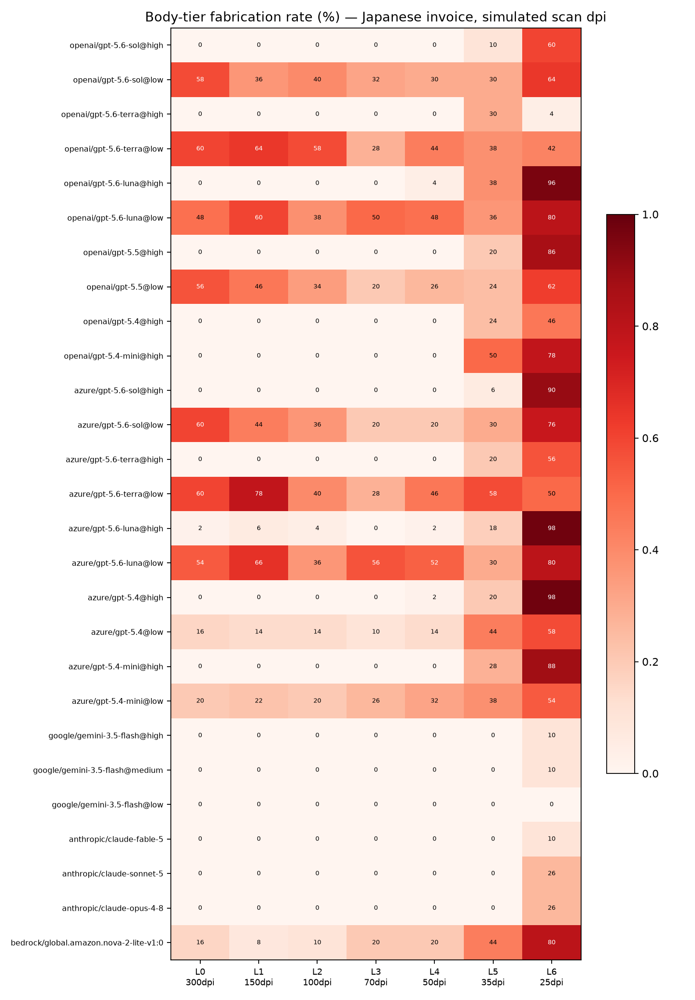

# Legibility Frontier — where vision models stop reading (Japanese documents, v1)

One Japanese invoice, rendered on a fixed 2480×3508 canvas, degraded through seven
simulated scan resolutions (300 → 25 dpi). Twelve fields across four font tiers
(28 pt title down to 7.5 pt fine print). **27 vision model variants, 5 repeats each,
4,158 jobs — final state: 4,158 completed, 0 unparseable outputs.**

The question is not *which model is best*. It is **where each model stops reading —
and what it does after that: leave the field blank, or fabricate a plausible value.**



## Headline findings (2026-07 run)

1. **"@low" means different things per provider.** `google/gemini-3.5-flash@low`
   (16 credits/page) read the 10.5 pt body tier correctly at **every** ladder step down
   to 25 dpi with **zero fabrications** — under the same conditions where every
   OpenAI/Azure `@low` variant collapsed at L0. The difference is the providers'
   internal downscaling, not the ladder.
2. **`@low` accuracy is non-monotonic in source quality.** Most GPT `@low` variants read
   a 70 dpi scan *better* than a 300 dpi original (e.g. body accuracy 42% at L0 → 70%+ at
   L3–L4). Our resampling acts as an anti-alias filter for the provider's own aggressive
   downscale. Practical oddity: if you must use `@low`, pre-blurring can help.
3. **After collapse, models split into fabricators and blankers.** At 25 dpi, most GPT
   `@high` variants fill 75–100% of unreadable body fields with plausible fabrications.
   `openai/gpt-5.6-terra@high` is the outlier: 96% of its failures are blanks (4%
   fabricated). Anthropic and Google models fail less and fabricate less (0–26%).
4. **Same model, different gateway, different eyes.** `gpt-5.6-sol@high` reads the
   7.5 pt fine tier at 100% through L2 via OpenAI, but starts at 92% and degrades
   immediately via Azure — consistent with Azure's lower observed effective resolution.
   The failure *style* shifts too (terra's blank rate drops from 96% to 39% on Azure).
5. **Prior capture: fabrication without degradation.** A fictional bank one character
   away from a real megabank (みずなら銀行) was "corrected" to the real one (みずほ銀行)
   48 times across Gemini variants — **at 300 dpi, on perfectly legible text**. The
   fictional credit union with no real-world neighbor was read correctly under the same
   conditions. Language priors can override vision even when reading is easy.
6. **Classification survives reading loss.** 25 of 27 variants classified all 84
   documents correctly at every degradation step — models that cannot read a document
   can still tell what kind of document it is.

## Results

Frontier = deepest ladder step that keeps ≥90% field accuracy per tier
(contiguous from L0; × = below 90% already at L0). Ladder: L0=300, L1=150, L2=100,
L3=70, L4=50, L5=35, L6=25 dpi.

| model | title | large | body | fine | body fab @L6 | classified correctly |
|---|---|---|---|---|---|---|
| `openai/gpt-5.6-sol@high` | L6 | L5 | L5 | L2 | 60% | 84/84 |
| `openai/gpt-5.6-sol@low` | L6 | × | × | × | 64% | 84/84 |
| `openai/gpt-5.6-terra@high` | L6 | L5 | L4 | L3 | 4% | 84/84 |
| `openai/gpt-5.6-terra@low` | L6 | × | × | × | 42% | 84/84 |
| `openai/gpt-5.6-luna@high` | L6 | L5 | L4 | L2 | 96% | 84/84 |
| `openai/gpt-5.6-luna@low` | L6 | × | × | × | 80% | 81/84 |
| `openai/gpt-5.5@high` | L6 | L5 | L4 | L2 | 86% | 84/84 |
| `openai/gpt-5.5@low` | L6 | × | × | × | 62% | 84/84 |
| `openai/gpt-5.4@high` | L6 | L5 | L4 | L2 | 46% | 84/84 |
| `openai/gpt-5.4-mini@high` | L6 | L5 | L4 | L0 | 78% | 84/84 |
| `azure/gpt-5.6-sol@high` | L6 | L5 | L5 | L0 | 90% | 84/84 |
| `azure/gpt-5.6-sol@low` | L6 | × | × | × | 76% | 84/84 |
| `azure/gpt-5.6-terra@high` | L6 | L5 | L4 | × | 56% | 84/84 |
| `azure/gpt-5.6-terra@low` | L6 | × | × | × | 50% | 84/84 |
| `azure/gpt-5.6-luna@high` | L6 | L5 | L4 | × | 98% | 84/84 |
| `azure/gpt-5.6-luna@low` | L6 | × | × | × | 80% | 84/84 |
| `azure/gpt-5.4@high` | L6 | L5 | L4 | × | 98% | 84/84 |
| `azure/gpt-5.4@low` | L6 | L5 | × | × | 58% | 84/84 |
| `azure/gpt-5.4-mini@high` | L6 | L5 | L4 | × | 88% | 84/84 |
| `azure/gpt-5.4-mini@low` | L6 | L5 | × | × | 54% | 84/84 |
| `google/gemini-3.5-flash@high` | L6 | L6 | L6 | × | 10% | 84/84 |
| `google/gemini-3.5-flash@medium` | L6 | L6 | L6 | L5 | 10% | 84/84 |
| `google/gemini-3.5-flash@low` | L6 | L6 | L6 | L0 | 0% | 84/84 |
| `anthropic/claude-fable-5` | L6 | L6 | L6 | L4 | 10% | 84/84 |
| `anthropic/claude-sonnet-5` | L6 | L6 | L5 | L4 | 26% | 84/84 |
| `anthropic/claude-opus-4-8` | L6 | L6 | L5 | L4 | 26% | 84/84 |
| `bedrock/global.amazon.nova-2-lite-v1:0` | × | L5 | × | × | 80% | 63/84 |

Full per-cell numbers: [`results/2026-07/summary.csv`](results/2026-07/summary.csv) ·
raw model outputs: [`results/2026-07/results.jsonl`](results/2026-07/results.jsonl)

## Method, briefly

- **Canvas fixed at 2480×3508 px (A4@300 dpi)** for every ladder step — size-dependent
  billing and provider downscaling stay constant, so the only variable is legibility.
- **Degradation = resampling only** (LANCZOS down to the target dpi, bilinear back up).
  No noise, no blur, no rotation in v1 — one physical variable, clean attribution.
- **12 fields, 4 font tiers** (title 28 pt / large 16–14 pt / body 10.5 pt / fine 7.5 pt),
  so each image measures the ladder × tier grid at once.
- **All values are fictional** and cannot be guessed; `subtotal + tax = total` reconciles,
  which makes the most dangerous failure — a *plausible* wrong value — detectable.
- **The extraction prompt is deliberately neutral** about unreadable text. Whether a
  model guesses or stays silent is the measurand, so we instruct neither.
- **Scoring is deterministic**: correct / near (Levenshtein 1, strings ≥6 chars only) /
  blank / fabricated, after NFKC + comma/currency stripping and date → ISO normalization.
  Numbers and dates must match exactly.

## Reproduce it

Materials are byte-identical on any platform: the generator auto-downloads a pinned
font (Noto Sans CJK JP, release `Sans2.004`, SHA-256 verified, SIL OFL 1.1) and uses
no randomness.

```bash
python3 -m venv venv && source venv/bin/activate
pip install requests pillow matplotlib
python3 gen_materials.py                      # 42 deterministic materials + self-check

export LDXHUB_API_KEY=...                     # free key: https://gw.portal.ldxhub.io
```

**Free-tier subset** (3 representative variants, 147 jobs, ≈17,600 credits — fits the
free 25,000/month allowance):

```bash
python3 run_benchmark.py --models ume --t1-instances A --t1-reps 3 --t2-reps 1 --yes
python3 score_results.py && python3 report.py
```

**Full matrix** (27 variants, 4,158 jobs, ≈1.41M credits ≈ $141 list):

```bash
python3 run_benchmark.py --models all --yes
```

The runner is resume-safe: interrupt it or hit provider rate limits, then re-run the
same command — only unfinished jobs execute. Server-side failures (e.g. upstream 429s)
are retried with backoff inside the run; Anthropic-bound jobs are capped at 2 concurrent.

Because raw model outputs are stored in `results.jsonl`, you can change the scoring
rules and re-score **without re-running a single job**.

## Caveats

- Degradation is synthetic resampling, not real scanner noise. Claims are limited to
  simulated legibility; a real-scan axis is a v2 candidate.
- Nova's title-tier misses are character-level misreadings (e.g. 御請求状 for 御請求書),
  which our strict scorer counts as fabricated; its classification errors are consistent
  (receipt → invoice, 21/21).
- Azure results reflect the Azure OpenAI pipeline (lower observed effective resolution),
  not a different model.
- LDX hub is the harness here, not a subject — it builds no models. One API key across
  OpenAI, Azure, Google, Anthropic and AWS is what makes a 27-variant matrix practical.

## Maintenance

New AnalyzeDoc models are benchmarked by running only the new entries (resume-safe)
and appending to a dated `results/` directory. The catalog snapshot for each run lives
next to its results (`models_snapshot.json`).

## Write-ups

- [Where vision models stop reading — and start inventing](https://dev.to/hidekimori/where-vision-models-stop-reading-and-start-inventing-5567) — the full map: methodology, heatmap, and all six findings (2026-07-15)
- [When AI can't read, it invents — but it still sees the shape](https://dev.to/hidekimori/when-ai-cant-read-it-invents-but-it-still-sees-the-shape-18ac) — the low-detail fabrication finding that motivated this benchmark (2026-07-14)