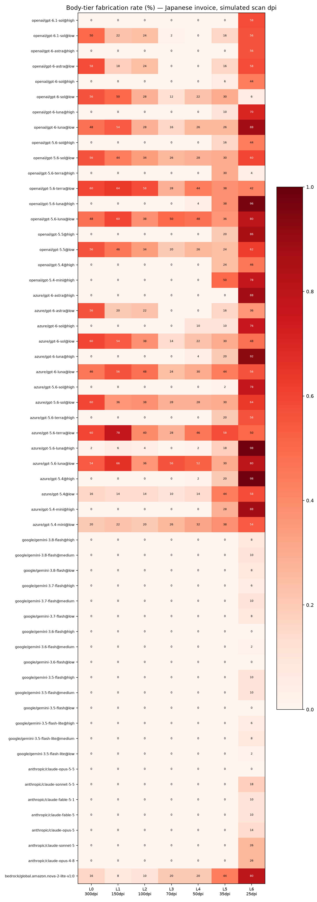

# Legibility Frontier — where vision models stop reading (Japanese documents, v1)

One Japanese invoice, rendered on a fixed 2480×3508 canvas, degraded through seven
simulated scan resolutions (300 → 25 dpi). Twelve fields across four font tiers
(28 pt title down to 7.5 pt fine print). **57 vision model variants, 5 repeats each,
8,778 jobs — final state: 8,778 completed, 0 unparseable outputs.**

The question is not *which model is best*. It is **where each model stops reading —
and what it does after that: leave the field blank, or fabricate a plausible value.**



## Headline findings (2026-07 run)

1. **"@low" means different things per provider.** `google/gemini-3.5-flash@low`
   (16 credits/page) read the 10.5 pt body tier correctly at **every** ladder step down
   to 25 dpi with **zero fabrications** — under the same conditions where every
   OpenAI/Azure `@low` variant collapsed at L0. The difference is the providers'
   internal downscaling, not the ladder.
2. **`@low` accuracy is non-monotonic in source quality.** Most GPT `@low` variants read
   a 70 dpi scan *better* than a 300 dpi original (e.g. body accuracy 42% at L0 → 70%+ at
   L3–L4). Our resampling acts as an anti-alias filter for the provider's own aggressive
   downscale. Practical oddity: if you must use `@low`, pre-blurring can help.
3. **After collapse, models split into fabricators and blankers.** At 25 dpi, most GPT
   `@high` variants fill 75–100% of unreadable body fields with plausible fabrications.
   `openai/gpt-5.6-terra@high` is the outlier: 96% of its failures are blanks (4%
   fabricated). Anthropic and Google models fail less and fabricate less (0–26%).
4. **Same model, different gateway, different eyes.** `gpt-5.6-sol@high` reads the
   7.5 pt fine tier at 100% through L2 via OpenAI, but starts at 92% and degrades
   immediately via Azure — consistent with Azure's lower observed effective resolution.
   The failure *style* shifts too (terra's blank rate drops from 96% to 39% on Azure).
   **Partly superseded by the 2026-09-04 and 2026-09-23 updates below**: the depth gap
   closes for GPT-6 Astra but not for GPT-6 Sol, while the fabrication gap persists on both.
   The Azure GPT-6 Sol / Luna rows predate OpenAI's 2026-09-25 image fix and await
   re-measurement (see the 2026-09-28 update).
5. **Prior capture: fabrication without degradation.** A fictional bank one character
   away from a real megabank (みずなら銀行) was "corrected" to the real one (みずほ銀行)
   48 times across Gemini variants — **at 300 dpi, on perfectly legible text**. The
   fictional credit union with no real-world neighbor was read correctly under the same
   conditions. Language priors can override vision even when reading is easy.
6. **Classification survives reading loss.** 53 of 57 variants classified all 84
   documents correctly at every degradation step — models that cannot read a document
   can still tell what kind of document it is. Two of the four exceptions are the Azure
   GPT-6 Luna variants, measured before OpenAI's 2026-09-25 image fix; after the fix,
   both OpenAI-direct Luna variants classify all 84 (see the 2026-09-28 update).

> **Update 2026-07-24:** Gemini 3.6 Flash and Gemini 3.5 Flash-Lite added (33 variants).
> `gemini-3.6-flash@high` holds the 7.5 pt fine tier to L5 (35 dpi) — a step
> `gemini-3.5-flash@high` never clears. `gemini-3.6-flash@medium` and `@low` show **zero**
> body-tier fabrication even at 25 dpi. And `gemini-3.5-flash-lite@low` — the cheapest
> cell in the catalog at 4 credits/page — holds the 10.5 pt body tier through L6 with 2%
> fabrication.

> **Update 2026-07-25:** Claude Opus 5 added (34 variants), same-day. Its frontier
> matches `claude-sonnet-5` and `claude-opus-4-8` (body tier to L5) — among Anthropic
> models only `claude-fable-5` holds body at L6 — but after collapse it fabricates
> less: 14% at 25 dpi versus 26% for both Opus 4.8 and Sonnet 5.

> **Update 2026-08-15:** Gemini 3.7 Flash added (37 variants). It carries the same rates
> as 3.6 Flash — Google's introductory $0.75/$3.75 runs to 2026-12-31, after which the
> standard $1.50/$7.50 applies, which is what 3.6 costs today. Same price, three weeks
> newer. On this benchmark it does not read better: body-tier fabrication at 25 dpi is
> 10/150 across the three resolution variants against 2/150 for 3.6 (Fisher p=0.035).
> Caveat: 3.6 was measured on 2026-07-24 and not re-run, so this compares two points
> three weeks apart, not two simultaneous measurements. **Superseded in part by the
> 2026-09-03 re-run below** — the fabrication gap reproduced and strengthened, but the
> claim that `@low` loses the fine tier (L0 → ×) turned out to be an artifact of the
> time gap: under simultaneous measurement 3.6`@low` reaches × as well.

> **Update 2026-09-01:** Claude Fable 5.1 added (38 variants), same-day. Anthropic keeps
> Fable 5's rates unchanged at $10/$50, so this is a same-price successor. On this
> benchmark it matches `claude-fable-5` on the title, large and body tiers (all L6) and
> extends the 7.5 pt fine tier by one step, L4 → L5. Body-tier fabrication at 25 dpi is
> identical at 10%. Within Anthropic, only the two Fable variants hold body at L6; Opus 5,
> Sonnet 5 and Opus 4.8 stop at L5. Caveat: `claude-fable-5` was measured on 2026-08-14
> and not re-run, so this compares two points two weeks apart.

> **Update 2026-09-03:** Gemini 3.8 Flash added (41 variants), same-day — and this time
> `gemini-3.6-flash` and `gemini-3.7-flash` were **re-run alongside it**, so the three
> Flash 3.x point releases are measured simultaneously for the first time. Rates are
> identical across all three (45/225, page 66/32/16); Google's introductory window covers
> the whole Flash 3.x family under a single 2026-12-31 end date and was not reset for 3.8.
> Three results:
> **(a) The 3.6-vs-3.7 fabrication gap reproduced and strengthened.** Body-tier
> fabrication at 25 dpi is 1/150 for 3.6 against 12/150 for 3.7 (Fisher p=0.0028, up from
> p=0.035 when the two were measured three weeks apart).
> **(b) 3.8 is statistically indistinguishable from 3.7** (13/150 vs 12/150, p=1.00) and
> differs from 3.6 at p=0.0015. So the step from 3.6 to 3.7 was not a one-off: it is a
> level shift that 3.8 inherits. Same price, two releases newer, still fabricating ~12×
> more than 3.6 after collapse.
> **(c) One earlier claim did not survive.** The 2026-08-15 note said 3.7`@low` loses the
> fine tier where 3.6`@low` held it at L0. Re-measured together, both reach × — that
> difference was a property of the three-week gap, not of the models.
> Individual cells moved too: 3.6`@high` fabrication went 4% → 0%, 3.6`@medium` fine tier
> L4 → L5, 3.7`@low` fabrication 2% → 8%. With 0–13 fabricated fields per 150 and a
> frontier defined by a 90% threshold, a single flipped field can move a step, so these
> movements are consistent with run-to-run noise rather than evidence of a provider-side
> update. The 3.6-vs-3.7/3.8 gap is an order of magnitude above that noise floor.

> **Update 2026-09-04:** GPT-6 Astra added (45 variants), same-day — and `gpt-5.6-sol` was
> **re-run alongside it**, so the two generations are measured simultaneously on both
> gateways. Astra costs $10/$50, twice Sol's $5/$30, and is the most expensive per-page
> cell in the OpenAI catalog at 1,204 credits. Three results:
> **(a) Astra reads deeper and invents more.** Against Sol on the same day, the direct
> route gains a step on both the 10.5 pt body tier (L4 → L5) and the 7.5 pt fine tier
> (L2 → L3) — the deepest fine-tier frontier of any GPT variant, matching
> `gpt-5.6-terra@high`. Body-tier fabrication at 25 dpi rises with it, 44% → 56%. Reading
> further and staying quiet are not the same axis.
> **(b) The gateway gap in *depth* is generation-dependent.** Sol reads the fine tier to
> L2 via OpenAI but fails it at L0 via Azure — a two-step gap that survived a re-run, so
> it is not an artifact of measurement dates. Astra reaches L3 on **both** routes. The
> vision-token budgets are unchanged (3,008 direct, 1,390 Azure), so a token-budget
> difference that used to cost two ladder steps now costs none. **Narrowed by the
> 2026-09-23 update below**: GPT-6 Sol does not close the gap, so the closure belongs to
> Astra, not to the generation.
> **(c) The gateway gap in *failure style* is not.** Fabrication after collapse still
> splits by route, and by almost the same margin in both generations: Sol 44% → 78%
> (34 points), Astra 56% → 88% (32 points). The gateway no longer changes where a model
> stops reading; it still changes what the model does afterwards.
> One more comparison is available at equal price: `claude-fable-5-1` carries the same
> character rates as Astra ($10/$50) and beats it on every tier — body L6 vs L5, fine L5
> vs L3, fabrication 10% vs 56% — at a higher page rate (1,909 vs 1,204).
> Sol's own numbers moved as well: body L5 → L4 on the direct route, and fabrication fell
> in **all four** Sol variants (60→44, 64→60, 90→78, 76→64). A single frontier step is
> within the noise described above, but four same-direction moves are worth noting rather
> than explaining away.

> **Update 2026-09-23:** GPT-6 Sol, GPT-6 Luna and Claude Opus 5.5 added (54 variants),
> GPT-6 on both gateways. No existing variant was re-run, so every comparison below spans
> weeks to months; measurement dates are given where they matter. Four results:
> **(a) The depth gap closed for Astra, not for the generation.** GPT-6 Sol reads the
> 7.5 pt fine tier to L2 via OpenAI and not at all via Azure (× — below 90% even at
> 300 dpi), a wider gap than `gpt-5.6-sol`'s L2 → L0. Astra remains the only model whose
> fine tier survives the Azure route undiminished. The vision-token budgets were
> re-measured for the new models and are unchanged (3,008 direct, 1,390 Azure), so the
> budget difference that costs Astra nothing still costs Sol the fine tier entirely.
> **(b) At equal page cost, opposite failure styles.** `gpt-6-sol@high` and
> `gpt-5.6-terra@high` both cost 241 credits per page. Sol reads the body tier one step
> deeper (L5 vs L4), Terra the fine tier one step deeper (L3 vs L2). At 25 dpi neither
> reads the body tier, and they fail in opposite directions: Sol answers 40 of 50 body
> fields and 31 of them are fabricated; Terra leaves 46 blank and fabricates 2 (Fisher
> p≈2.6×10⁻¹⁰). Terra's row dates from the 2026-07 run; a gap this size is far outside
> the run-to-run noise described above.
> **(c) Claude Opus 5.5 blanks instead of guessing.** Its frontier is identical to
> `claude-opus-5` (L6 / L6 / L5 / L4), so on reading depth it does not reach the Fable
> tier. The difference is past the frontier. At 25 dpi Opus 5.5 answers 31 of 50 body
> fields — all correct — and leaves the other 19 blank: zero fabrications, the only
> Anthropic variant at 0%. Opus 5 answers all 50 and fabricates 7 (Fisher p=0.013);
> Fable 5.1 answers all 50 and fabricates 5 (p=0.056). Opus 5.5 trades coverage for
> precision at the edge. Caveat: Opus 5 was measured on 2026-07-25 and Fable 5.1 on
> 2026-09-01; neither was re-run.
> **(d) Every GPT-6 Luna variant misclassifies.** The four Luna variants score 78, 83, 80
> and 78 of 84 on classification, against one of the four GPT-5.6 Luna variants.
> `openai/gpt-6-luna@high` is also the only variant besides Nova that loses the 28 pt
> title at L6, and neither route reads the fine tier even at 300 dpi. At 2 credits per
> page, Luna `@low` on either route is now the cheapest cell in the catalog.
> **Superseded in part by the 2026-09-28 update below**: the GPT-6 Sol and Luna rows
> above were measured before OpenAI's 2026-09-25 image-encoding fix. Re-run after the
> fix, (d) no longer holds for the OpenAI-direct Luna variants, and the Sol count in (b)
> becomes 29 of 50 (22 of 50 in the 2026-09-30 same-day re-run). The Azure rows in (a)
> and (d) await re-measurement.

> **Update 2026-09-28:** OpenAI fixed an image-encoding bug in GPT-6 Sol and GPT-6 Luna on
> 2026-09-25, two days after the measurements above, and advised re-running image
> evaluations. The four OpenAI-direct GPT-6 Sol / Luna variants were re-run after the fix
> (the pre-fix records remain in commit `3c6db74`), and Claude Sonnet 5.5 was added
> (55 variants). The four Azure GPT-6 Sol / Luna rows still carry pre-fix data: Azure file
> uploads were failing during this run, so they could not be re-measured. Vision-token
> budgets were re-measured after the fix and did not change (3,008 direct, 1,390 Azure),
> so the fix changed what the models see, not what a page costs. Three results:
> **(a) The fix mattered for Luna, not for Sol.** GPT-6 Sol @high keeps its frontier
> (L6 / L5 / L5 / L2), and its 25 dpi body fabrications move only from 31 to 29 of 50, so
> the Sol-versus-Terra contrast stands. GPT-6 Luna @high moves from L5 / L5 / L4 / × to
> L6 / L5 / L5 / L2 — identical to Sol @high, at 13 credits per page instead of 241 — and
> classifies all 84 documents (was 78). The title loss and fine-tier failure reported for
> it on 2026-09-23 disappear after the fix.
> **(b) Luna @low now guesses more.** Its frontier is unchanged (title only), but at
> 25 dpi its body blanks fall from 17 to 2 of 50 while its fabrications rise from 28 to
> 44 (Fisher p=0.001). After the fix it fills unreadable fields instead of leaving them
> empty.
> **(c) Claude Sonnet 5.5 reads like Sonnet 5 and guesses rather than blanks.** Its
> frontier matches Sonnet 5 and Opus 5.5 (L6 / L6 / L5 / L4). At 25 dpi it answers every
> body field — 41 correct, 9 fabricated, none blank — where Opus 5.5 left 19 blank and
> fabricated none (Fisher p=0.0026 on fabrications, measured five days apart). Blanking
> at the edge is Opus 5.5's behavior, not the 5.5 generation's. Against Sonnet 5 (13 of
> 50, from the 2026-07 run) the drop is not significant (p=0.47).
> **Superseded in part by the 2026-09-30 update below**: GPT-6 Sol was re-run alongside
> GPT-6.1 Sol, and its `@high` count in (a) becomes 22 fabricated and 18 blank of 50. The
> Sol-versus-Terra contrast still stands (Terra: 2 fabricated, 46 blank; Fisher p≈2.9×10⁻⁶
> on fabrications).

> **Update 2026-09-30:** GPT-6.1 Sol added via OpenAI (57 variants). It is a same-price
> successor to GPT-6 Sol ($2/$10, the same 241 / 26 credit page rates), the kind of release
> the maintenance rule below normally skips. It earned a row because it has no
> non-reasoning mode — `reasoning.effort` starts at `low` — while GPT-6 Sol runs with
> reasoning off here, a difference that could move the blank-versus-fabricate finding.
> GPT-6 Sol was re-run the same day so the two could be compared directly (its 2026-09-28
> records remain in commit `90dc788`). The Azure route is not in this run: Azure file
> uploads were still failing, so `azure/gpt-6.1-sol` is in the catalog but not in the
> matrix. Two results:
> **(a) Same frontier, almost no blanks.** GPT-6.1 Sol reads exactly as deep as GPT-6 Sol
> at both resolutions (L6 / L5 / L5 / L2 at `@high`, the title tier only at `@low`). The
> difference is past the frontier: at 25 dpi it left 1 of 100 body fields blank across the
> two variants, where GPT-6 Sol left 61 of 100 blank the same day (Fisher p≈5×10⁻²³). It
> turns those blanks into both more correct answers and more fabrications — at `@high` 21
> vs 10 correct (p=0.03) and 29 vs 22 fabricated (not significant); at `@low` 21 vs 4
> correct and 28 vs 3 fabricated (p≈5.5×10⁻⁸).
> **(b) GPT-6 Sol `@low` moved in two days.** Against the 2026-09-28 run, its 25 dpi body
> blanks rose from 21 to 43 of 50 and its fabrications fell from 15 to 3 (p≈7.6×10⁻⁶ on
> blanks), while `@high` stayed within noise (fabrications 29 → 22, p=0.23). Price and
> model ID are unchanged, and two runs cannot tell a model update from run-to-run
> variance, so the table carries the 2026-09-30 numbers and (a) compares only within that
> day.

## Results

Frontier = deepest ladder step that keeps ≥90% field accuracy per tier
(contiguous from L0; × = below 90% already at L0). Ladder: L0=300, L1=150, L2=100,
L3=70, L4=50, L5=35, L6=25 dpi.

| model | title | large | body | fine | body fab @L6 | classified correctly |
|---|---|---|---|---|---|---|
| `openai/gpt-6.1-sol@high` | L6 | L5 | L5 | L2 | 58% | 84/84 |
| `openai/gpt-6.1-sol@low` | L6 | × | × | × | 56% | 84/84 |
| `openai/gpt-6-astra@high` | L6 | L5 | L5 | L3 | 56% | 84/84 |
| `openai/gpt-6-astra@low` | L6 | × | × | × | 58% | 84/84 |
| `openai/gpt-6-sol@high` | L6 | L5 | L5 | L2 | 44% | 84/84 |
| `openai/gpt-6-sol@low` | L6 | × | × | × | 6% | 84/84 |
| `openai/gpt-6-luna@high` | L6 | L5 | L5 | L2 | 70% | 84/84 |
| `openai/gpt-6-luna@low` | L6 | × | × | × | 88% | 84/84 |
| `openai/gpt-5.6-sol@high` | L6 | L5 | L4 | L2 | 44% | 84/84 |
| `openai/gpt-5.6-sol@low` | L6 | × | × | × | 60% | 84/84 |
| `openai/gpt-5.6-terra@high` | L6 | L5 | L4 | L3 | 4% | 84/84 |
| `openai/gpt-5.6-terra@low` | L6 | × | × | × | 42% | 84/84 |
| `openai/gpt-5.6-luna@high` | L6 | L5 | L4 | L2 | 96% | 84/84 |
| `openai/gpt-5.6-luna@low` | L6 | × | × | × | 80% | 81/84 |
| `openai/gpt-5.5@high` | L6 | L5 | L4 | L2 | 86% | 84/84 |
| `openai/gpt-5.5@low` | L6 | × | × | × | 62% | 84/84 |
| `openai/gpt-5.4@high` | L6 | L5 | L4 | L2 | 46% | 84/84 |
| `openai/gpt-5.4-mini@high` | L6 | L5 | L4 | L0 | 78% | 84/84 |
| `azure/gpt-6-astra@high` | L6 | L5 | L5 | L3 | 88% | 84/84 |
| `azure/gpt-6-astra@low` | L6 | × | × | × | 36% | 84/84 |
| `azure/gpt-6-sol@high` | L6 | L5 | L5 | × | 76% | 84/84 |
| `azure/gpt-6-sol@low` | L6 | × | × | × | 48% | 84/84 |
| `azure/gpt-6-luna@high` | L6 | L5 | L4 | × | 92% | 80/84 |
| `azure/gpt-6-luna@low` | L6 | × | × | × | 56% | 78/84 |
| `azure/gpt-5.6-sol@high` | L6 | L5 | L5 | L0 | 78% | 84/84 |
| `azure/gpt-5.6-sol@low` | L6 | × | × | × | 64% | 84/84 |
| `azure/gpt-5.6-terra@high` | L6 | L5 | L4 | × | 56% | 84/84 |
| `azure/gpt-5.6-terra@low` | L6 | × | × | × | 50% | 84/84 |
| `azure/gpt-5.6-luna@high` | L6 | L5 | L4 | × | 98% | 84/84 |
| `azure/gpt-5.6-luna@low` | L6 | × | × | × | 80% | 84/84 |
| `azure/gpt-5.4@high` | L6 | L5 | L4 | × | 98% | 84/84 |
| `azure/gpt-5.4@low` | L6 | L5 | × | × | 58% | 84/84 |
| `azure/gpt-5.4-mini@high` | L6 | L5 | L4 | × | 88% | 84/84 |
| `azure/gpt-5.4-mini@low` | L6 | L5 | × | × | 54% | 84/84 |
| `google/gemini-3.8-flash@high` | L6 | L6 | L6 | L5 | 8% | 84/84 |
| `google/gemini-3.8-flash@medium` | L6 | L6 | L6 | L5 | 10% | 84/84 |
| `google/gemini-3.8-flash@low` | L6 | L6 | L6 | × | 8% | 84/84 |
| `google/gemini-3.7-flash@high` | L6 | L6 | L6 | L5 | 6% | 84/84 |
| `google/gemini-3.7-flash@medium` | L6 | L6 | L6 | L5 | 10% | 84/84 |
| `google/gemini-3.7-flash@low` | L6 | L6 | L6 | × | 8% | 84/84 |
| `google/gemini-3.6-flash@high` | L6 | L6 | L6 | L5 | 0% | 84/84 |
| `google/gemini-3.6-flash@medium` | L6 | L6 | L6 | L5 | 2% | 84/84 |
| `google/gemini-3.6-flash@low` | L6 | L6 | L6 | × | 0% | 84/84 |
| `google/gemini-3.5-flash@high` | L6 | L6 | L6 | × | 10% | 84/84 |
| `google/gemini-3.5-flash@medium` | L6 | L6 | L6 | L5 | 10% | 84/84 |
| `google/gemini-3.5-flash@low` | L6 | L6 | L6 | L0 | 0% | 84/84 |
| `google/gemini-3.5-flash-lite@high` | L6 | L6 | L6 | L3 | 6% | 84/84 |
| `google/gemini-3.5-flash-lite@medium` | L6 | L6 | L6 | L4 | 8% | 84/84 |
| `google/gemini-3.5-flash-lite@low` | L6 | L6 | L6 | × | 2% | 84/84 |
| `anthropic/claude-opus-5-5` | L6 | L6 | L5 | L4 | 0% | 84/84 |
| `anthropic/claude-sonnet-5-5` | L6 | L6 | L5 | L4 | 18% | 84/84 |
| `anthropic/claude-fable-5-1` | L6 | L6 | L6 | L5 | 10% | 84/84 |
| `anthropic/claude-fable-5` | L6 | L6 | L6 | L4 | 10% | 84/84 |
| `anthropic/claude-opus-5` | L6 | L6 | L5 | L4 | 14% | 84/84 |
| `anthropic/claude-sonnet-5` | L6 | L6 | L5 | L4 | 26% | 84/84 |
| `anthropic/claude-opus-4-8` | L6 | L6 | L5 | L4 | 26% | 84/84 |
| `bedrock/global.amazon.nova-2-lite-v1:0` | × | L5 | × | × | 80% | 63/84 |

Full per-cell numbers: [`results/2026-09/summary.csv`](results/2026-09/summary.csv) ·
raw model outputs: [`results/2026-09/results.jsonl`](results/2026-09/results.jsonl)

## Method, briefly

- **Canvas fixed at 2480×3508 px (A4@300 dpi)** for every ladder step — size-dependent
  billing and provider downscaling stay constant, so the only variable is legibility.
- **Degradation = resampling only** (LANCZOS down to the target dpi, bilinear back up).
  No noise, no blur, no rotation in v1 — one physical variable, clean attribution.
- **12 fields, 4 font tiers** (title 28 pt / large 16–14 pt / body 10.5 pt / fine 7.5 pt),
  so each image measures the ladder × tier grid at once.
- **All values are fictional** and cannot be guessed; `subtotal + tax = total` reconciles,
  which makes the most dangerous failure — a *plausible* wrong value — detectable.
- **The extraction prompt is deliberately neutral** about unreadable text. Whether a
  model guesses or stays silent is the measurand, so we instruct neither.
- **Scoring is deterministic**: correct / near (Levenshtein 1, strings ≥6 chars only) /
  blank / fabricated, after NFKC + comma/currency stripping and date → ISO normalization.
  Numbers and dates must match exactly.

## Reproduce it

Materials are byte-identical on any platform: the generator auto-downloads a pinned
font (Noto Sans CJK JP, release `Sans2.004`, SHA-256 verified, SIL OFL 1.1) and uses
no randomness.

```bash
python3 -m venv venv && source venv/bin/activate
pip install requests pillow matplotlib
python3 gen_materials.py                      # 42 deterministic materials + self-check

export LDXHUB_API_KEY=...                     # free key: https://gw.portal.ldxhub.io
```

**Free-tier subset** (3 representative variants, 147 jobs, ≈17,600 credits — fits the
free 25,000/month allowance):

```bash
python3 run_benchmark.py --models ume --t1-instances A --t1-reps 3 --t2-reps 1 --yes
python3 score_results.py && python3 report.py
```

**Full matrix** (57 variants, 8,778 jobs, ≈2.79M credits ≈ $279 list):

```bash
python3 run_benchmark.py --models all --yes
```

That is 2.1% above the 55-variant matrix. GPT-6.1 Sol is priced exactly like GPT-6 Sol,
down to its 241 / 26 credit page rates, so adding it moves the total by one Sol-sized
pair of rows. Per-page cost, not model count, is what drives this number.

The runner is resume-safe: interrupt it or hit provider rate limits, then re-run the
same command — only unfinished jobs execute. Server-side failures (e.g. upstream 429s)
are retried with backoff inside the run. Provider file-API limits are shaped server-side
by the gateway, so the runner applies no per-provider cap by default (`PROVIDER_LIMITS`
adds one if needed).

Because raw model outputs are stored in `results.jsonl`, you can change the scoring
rules and re-score **without re-running a single job**.

(The raw log contains 8,782 records; four are duplicate resubmissions after a
network interruption during the July run. The scorer takes the last record per job
key, so re-scoring this exact file reproduces the published tables.)

## Caveats

- Degradation is synthetic resampling, not real scanner noise. Claims are limited to
  simulated legibility; a real-scan axis is a v2 candidate.
- `results.jsonl` accumulates across runs — variants added in different months were not
  measured at the same time, so cross-variant comparisons span weeks. Rows are not
  re-run without a reason, and a provider updating a model behind an unchanged ID would
  leave stale rows. This is not hypothetical: when `gemini-3.6-flash` and
  `gemini-3.7-flash` were re-run on 2026-09-03 for a simultaneous comparison against 3.8,
  several cells moved (see the 2026-09-03 update) and one previously published difference
  disappeared. It happened again the next day: re-running the four `gpt-5.6-sol` variants
  alongside GPT-6 Astra moved one frontier step and lowered body-tier fabrication in all
  four of them. And on 2026-09-30, re-running GPT-6 Sol alongside GPT-6.1 Sol moved
  `gpt-6-sol@low`'s 25 dpi body results (see the 2026-09-30 update). When a comparison
  between specific variants is the point, re-run those variants together.
- Nova's title-tier misses are character-level misreadings (e.g. 御請求状 for 御請求書),
  which our strict scorer counts as fabricated; its classification errors are consistent
  (receipt → invoice, 21/21).
- Azure results reflect the Azure OpenAI pipeline (lower observed effective resolution),
  not a different model.
- `azure/gpt-6.1-sol` is in the AnalyzeDoc catalog but not in this matrix: Azure file
  uploads have been failing since 2026-09-28. The harness keeps its rates but leaves it out
  of `MODELS` until the route recovers, and the four Azure GPT-6 Sol / Luna rows likewise
  still carry data from before OpenAI's 2026-09-25 image fix.
- LDX hub is the harness here, not a subject — it builds no models. One API key across
  OpenAI, Azure, Google, Anthropic and AWS is what makes a 57-variant matrix practical.

## Maintenance

New AnalyzeDoc models are benchmarked by running only the new entries (resume-safe)
and appending to a dated `results/` directory. The catalog snapshot for each run lives
next to its results (`models_snapshot.json`). Earlier snapshots are kept — the 2026-07
run is at [`results/2026-07/`](results/2026-07/) and 2026-08 at
[`results/2026-08/`](results/2026-08/).

Not every new model is added. A release earns a row when it can move a finding — a new
provider, a new architecture, something that could falsify a claim above, or the next
observation point for an open question. Same-price successors that would only lengthen
the table are skipped. When the point is a comparison between specific variants, those
variants are re-run together rather than compared across months.

## Write-ups

- [Where vision models stop reading — and start inventing](https://dev.to/hidekimori/where-vision-models-stop-reading-and-start-inventing-5567) — the full map: methodology, heatmap, and all six findings (2026-07-15)
- [The model corrected reality](https://dev.to/hidekimori/the-model-corrected-reality-fob) — deep dive on finding 5: prior capture at full legibility (2026-07-21)
- [When AI can't read, it invents — but it still sees the shape](https://dev.to/hidekimori/when-ai-cant-read-it-invents-but-it-still-sees-the-shape-18ac) — the low-detail fabrication finding that motivated this benchmark (2026-07-14)